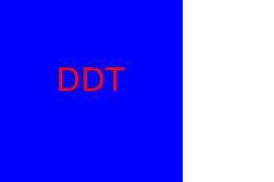
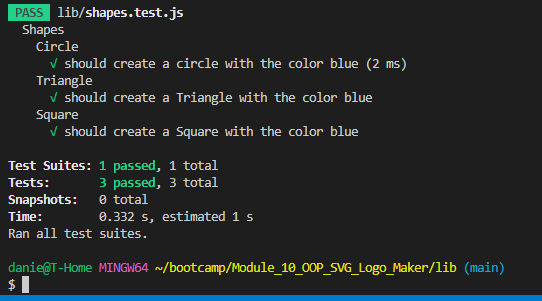

#  **SVG Logo Maker**

## Description
    
This application takes in some user inputs like 3 letters, colors and shape to make a simple logo. 
    
## Table of Contents 
    
- [Installation](#install)
- [Usage](#usage)
- [Credits](#credits)
- [License](#license)
- [Badges](#badges)
- [Features](#features)
- [Tests](#tests)
    
## Installation
 inquirer@8.2.4  
 jest  
    
## Usage
The user will run node index.js and the terminal will prompt some questions for the user. Type in responses and use the arrow keys to indicate the responses the user would like. It will run tests to ensure that he program is functioning correctly and then output the SVG logo to a specified folder. 

    
    
 

Walkthrough video link [SVG Logo Maker](https://drive.google.com/file/d/1oFizjPdvHOMYCOIIWYiXPb2m-CKMTF-B/view?usp=sharing)

## Questions

Project created by: [Daniel Tran](https://github.com/danieltran2016) 
You may directly reach my be contacting me at danieltran2016@gmail.com

    
## License

MIT License
   
Copyright (c) 2023 Danny Tran
    
Permission is hereby granted, free of charge, to any person obtaining a copy
of this software and associated documentation files (the "Software"), to deal
in the Software without restriction, including without limitation the rights
to use, copy, modify, merge, publish, distribute, sublicense, and/or sell
copies of the Software, and to permit persons to whom the Software is
furnished to do so, subject to the following conditions:
    
The above copyright notice and this permission notice shall be included in all
copies or substantial portions of the Software.
    
THE SOFTWARE IS PROVIDED "AS IS", WITHOUT WARRANTY OF ANY KIND, EXPRESS OR
IMPLIED, INCLUDING BUT NOT LIMITED TO THE WARRANTIES OF MERCHANTABILITY,
FITNESS FOR A PARTICULAR PURPOSE AND NONINFRINGEMENT. IN NO EVENT SHALL THE
AUTHORS OR COPYRIGHT HOLDERS BE LIABLE FOR ANY CLAIM, DAMAGES OR OTHER
LIABILITY, WHETHER IN AN ACTION OF CONTRACT, TORT OR OTHERWISE, ARISING FROM,
OUT OF OR IN CONNECTION WITH THE SOFTWARE OR THE USE OR OTHER DEALINGS IN THE
SOFTWARE.
    
---
    
## Badges
 

    
## Features
Node inquire, file storage, jest test and makes an SVG logo. 

    
## Tests

